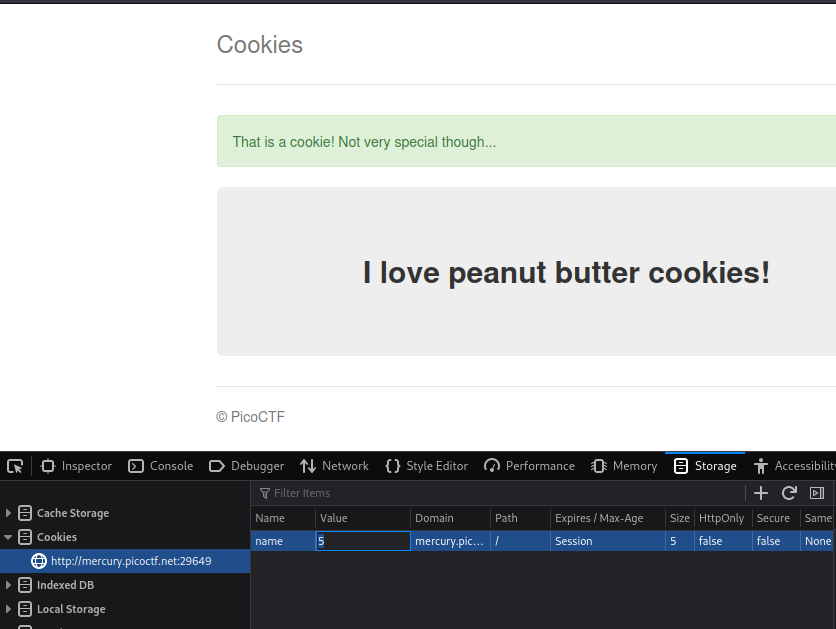
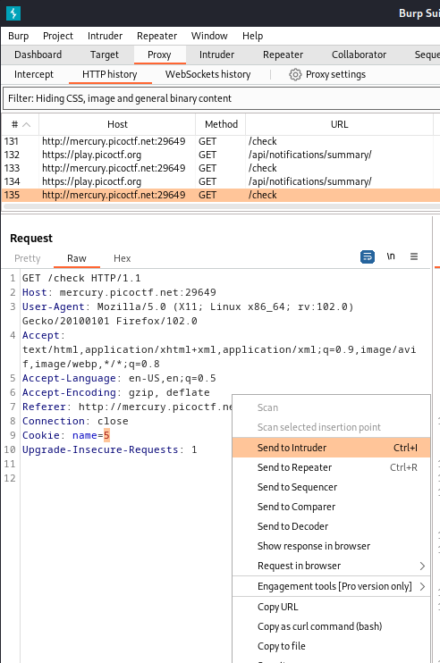

# Cookies

## Author
MADSTACKS

## Question
> Who doesn't love cookies? Try to figure out the best one. http://mercury.picoctf.net:29649/

## Hint
(None)
   
## Solution
The link brings us to the following page and as we can see when we inspect it and go to the *Cookies* section the value for the default page is `0`:

The moment we try changing that number we obtain different results, for example the cookie number `5` will render the following:

Instead of trying manually every value available, I used the *Intruder* functionality on BurpSuite to automate a sequence of numbers on the `Cookie: name` parameter:

The following shows the settings for a sequence of `Numbers` from `-1` to `30` by `1` step at the time:

On the right corner the attack can be initiated. The details we wanna look for are the `Length` values.
The avarage value is ~`1900` but we can indeed see a difference in *lengths* with two requests: the number `-1` has a length of `557`, that's just the error page. The other black sheep is the number `18` with a length of ~`1200`. Glancing at its *Response* we finally find the flag!

