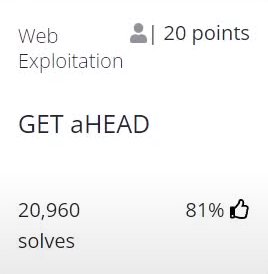
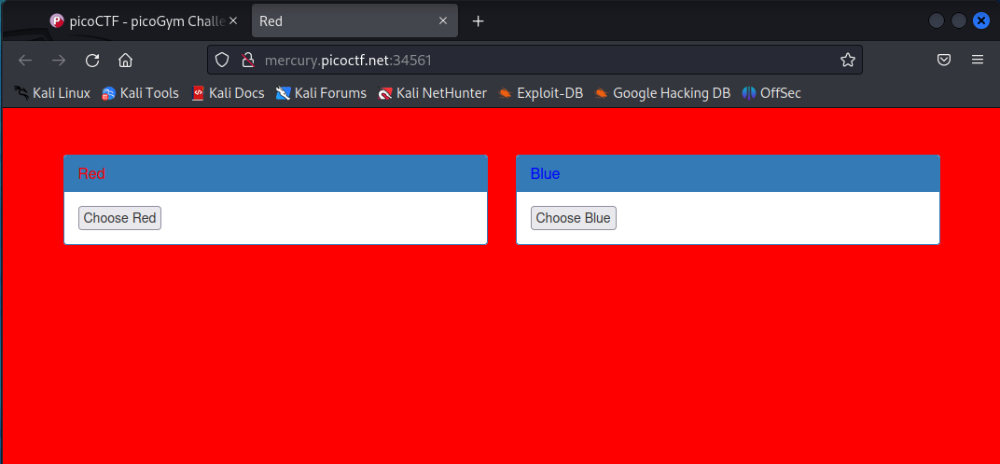
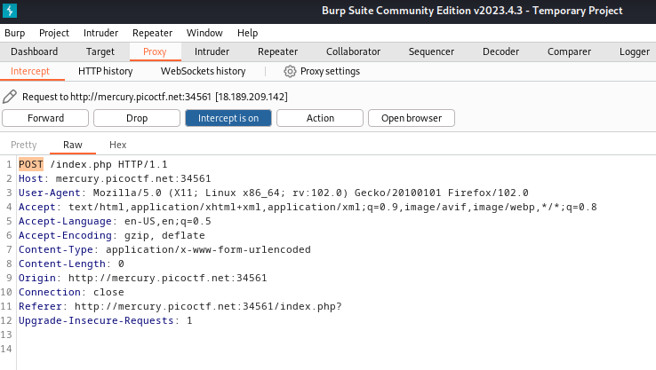
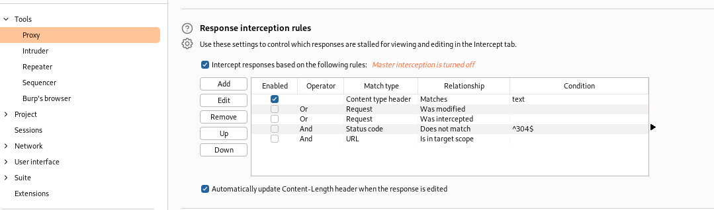
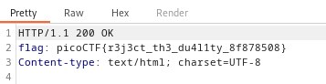

# GET aHEAD

## Author
MADSTACKS

## Question
> Find the flag being held on this server to get ahead of the competition http://mercury.picoctf.net:34561/

## Hint
1. Maybe you have more than 2 choices
2. Check out tools like Burpsuite to modify your requests and look at the responses
   
## Solution
The link brings us to the following page:

Selecting the two icons available will change the background. 
With Burpsuite Proxy I intercepted the request we send when changing the colors and I see that the request type is `POST`:

Looking back at the title of this exercise I imagined that I had to change the request type from `POST` to `HEAD`, but doing so I did not get any results. That is because I was just looking for the requests and not the responses. I proceeded to check the option in Burp to also display websites responses:

now changing the request to `HEAD` displays this response

