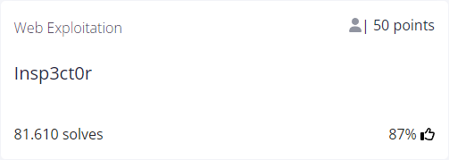
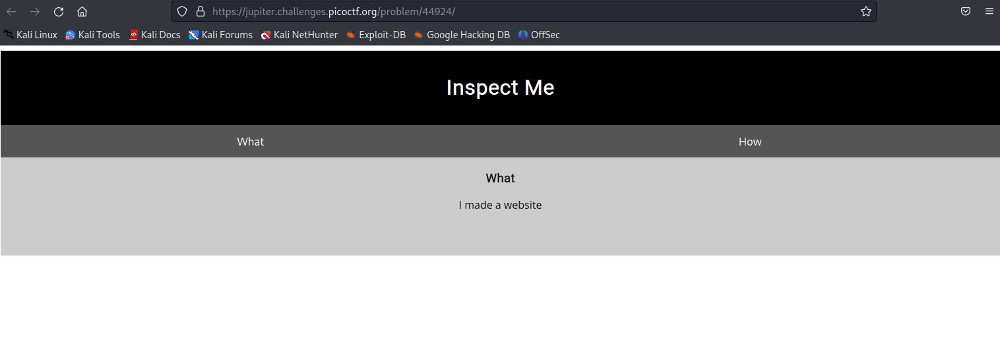

# Insp3ct0r


## Author
ZARATEC/DANNY

## Question
> Kishor Balan tipped us off that the following code may need inspection: https://jupiter.challenges.picoctf.org/problem/44924/ or http://jupiter.challenges.picoctf.org:44924

## Hint
1. How do you inspect web code on a browser?
2. There's 3 parts
   
## Solution
The link brings us to the following page:



We can istantly find the first part of the flag at the end of the source code:

```html
<!doctype html>
<html>
  <head>
    <title>My First Website :)</title>
    <link href="https://fonts.googleapis.com/css?family=Open+Sans|Roboto" rel="stylesheet">
    <link rel="stylesheet" type="text/css" href="mycss.css">
    <script type="application/javascript" src="myjs.js"></script>
  </head>

  <body>
    <div class="container">
      <header>
	<h1>Inspect Me</h1>
      </header>

      <button class="tablink" onclick="openTab('tabintro', this, '#222')" id="defaultOpen">What</button>
      <button class="tablink" onclick="openTab('tababout', this, '#222')">How</button>
      
      <div id="tabintro" class="tabcontent">
	<h3>What</h3>
	<p>I made a website</p>
      </div>

      <div id="tababout" class="tabcontent">
	<h3>How</h3>
	<p>I used these to make this site: <br/>
	  HTML <br/>
	  CSS <br/>
	  JS (JavaScript)
	</p>
	<!-- Html is neat. Anyways have 1/3 of the flag: picoCTF{tru3_d3 -->
      </div>
      
    </div>
    
  </body>
</html>
```
We can also see there are two interesting files inside `<head>` : `mycss.css` and `myjs.js`.

if we click on them we'll find the next two parts of the flag at the end of the resulting pages!

`mycss.css` says : 
`/* You need CSS to make pretty pages. Here's part 2/3 of the flag: t3ct1ve_0r_ju5t */`

`myjs.js` says : `/* Javascript sure is neat. Anyways part 3/3 of the flag: _lucky?f10be399} */`

Putting it all togeter we obtain the solution: `picoCTF{tru3_d3t3ct1ve_0r_ju5t_lucky?f10be399}`