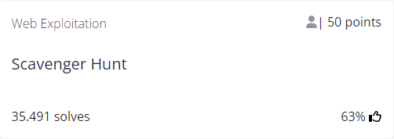
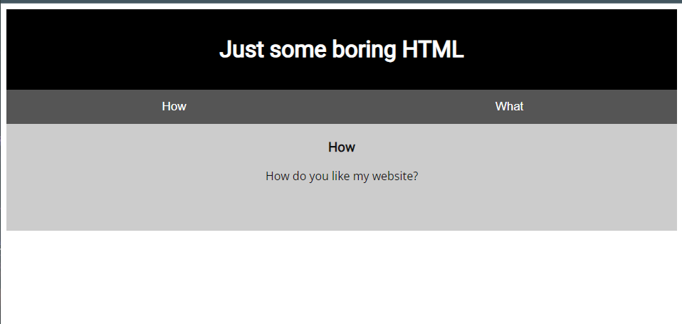
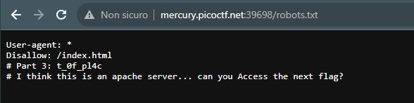
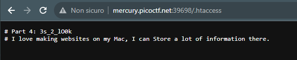
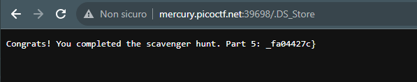

# Scavanger Hunt


## Author
MADSTACKS

## Question
> There is some interesting information hidden around this site http://mercury.picoctf.net:39698/. Can you find it?

## Hint
1. You should have enough hints to find the files, don't run a brute forcer.
   
## Solution
The link brings us to the following page:



We can istantly find the first part of the flag at the bottom of the source code:

```html
<!doctype html>
<html>
  <head>
    <title>Scavenger Hunt</title>
    <link href="https://fonts.googleapis.com/css?family=Open+Sans|Roboto" rel="stylesheet">
    <link rel="stylesheet" type="text/css" href="mycss.css">
    <script type="application/javascript" src="myjs.js"></script>
  </head>

  <body>
    <div class="container">
      <header>
		<h1>Just some boring HTML</h1>
      </header>

      <button class="tablink" onclick="openTab('tabintro', this, '#222')" id="defaultOpen">How</button>
      <button class="tablink" onclick="openTab('tababout', this, '#222')">What</button>

      <div id="tabintro" class="tabcontent">
		<h3>How</h3>
		<p>How do you like my website?</p>
      </div>

      <div id="tababout" class="tabcontent">
		<h3>What</h3>
		<p>I used these to make this site: <br/>
		  HTML <br/>
		  CSS <br/>
		  JS (JavaScript)
		</p>
	<!-- Here's the first part of the flag: picoCTF{t -->
      </div>

    </div>

  </body>
</html>
```

There are also two interesting files inside `<head>` : `mycss.css` and `myjs.js`.

Opening the `mycss.css` file will lead us to the second part of the flag:

`/* CSS makes the page look nice, and yes, it also has part of the flag. Here's part 2: h4ts_4_l0 */`

The `myjs.js` file will suggest us to look for some hidden directory:

`/* How can I keep Google from indexing my website? */`

I know this is likely referred to the `/robots.txt` dir and it indeed gave me the next part of the flag + another hint:



I didn't know what it was referring to so I googled *Apache Access File* and found the existence of the file `.htaccess`. An *.htaccess* file is used for an Apache web server as a way to configure the details of a website without altering the server configuration files. More about it on [this website](https://www.digitalocean.com/community/tutorials/how-to-use-the-htaccess-file).
So I went for it and this popped up:



And again I did not know what to do, so I googled *important "store" file in mac os* and found out that a Mac OS file called `DS_Store` *(Desktop Service Store)* is fundamental for visual informations. 
More about it on its [wiki page](https://en.wikipedia.org/wiki/.DS_Store). Searching for it will pop up the last part of the flag!



Putting it all togeter we obtain the solution: `picoCTF{th4ts_4_l0t_0f_pl4c3s_2_lO0k_fa04427c}`
