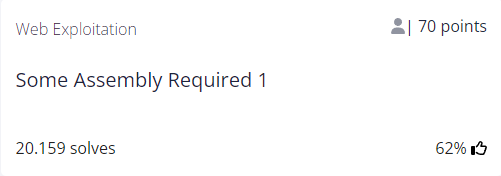
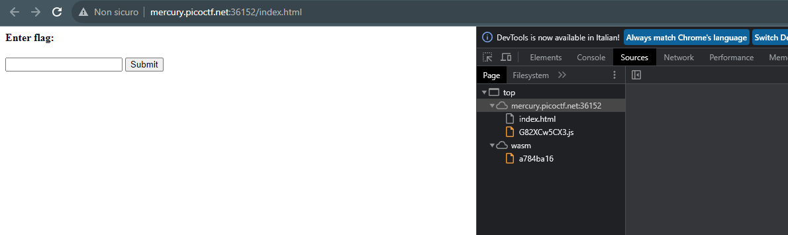
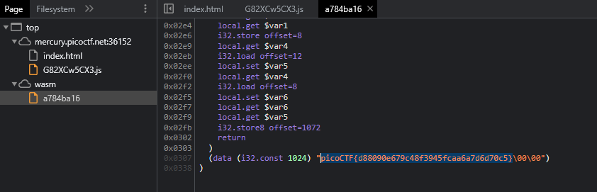
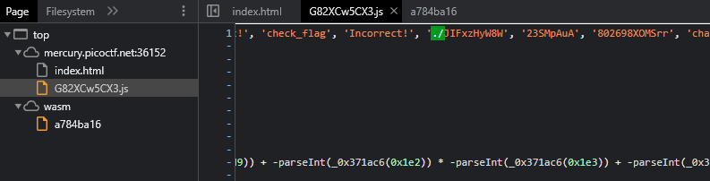

# Some Assembly Required 1


## Author
SEARS SCHULZ

## Question
> http://mercury.picoctf.net:36152/index.html

## Hint
(None)
   
## Solution 1
The link brings us to the following page and if we inspect it looking for the sources we find these three files:



I solved this exercise in 2 ways and none of those required assembly knowledge ;)

I begun just looking into those three files and istantly found the flag at the bottom of the third one, `a784ba16`:



## Solution 2

It seemed too easy to do, so I searched for another method and found out that the `G82XCw5CX3.js` contained a path:



I added it in the URL replacing `/index.html` and it brought me to a file called `JIFxzHyW8W` that contained the flag!

```bash
cat JIFxzHyW8W   

asm````pA  
           A 
            A 
             A 

A 
 A  
    A
     A
       
       memory__wasm_call_ctorsstrcmp
check_flaginput copy_char
                         __dso_handle
__global_base
__memory_base__heap_base
             __table_base
 
  *#    !A !  k!  6▒  6 (▒!  6 (!  6
                                    @@ (!A j!           6 -!
  
:
  (
   !
    A!
       
        
6       j!
  
  -!  :
 -
 -!A !  q!@ 
  !A !  q! -
!A !  q!  k!▒  ▒6

                  -
                   !A !▒  ▒q!-
!A !  q!  !    F!!A!" ! "q!# #
 -
  !$A !% $ %q!& -
!'A !( ' (q!) & )k!*  *6
                         (!+ +
                              L
                               A!A    !A    !      ! ! !  G!A!  sA!         q!
 

?#    !A!  k!  6
                   (
                    ! !  :    

                              2A 
                                +picoCTF{d88090e679c48f3945fcaa6a7d6d70c5}
```