# Who are you
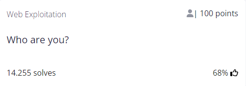

## Author
MADSTACKS

## Question
> Let me in. Let me iiiiiiinnnnnnnnnnnnnnnnnnnn http://mercury.picoctf.net:46199/

## Hint
1. It ain't much, but it's an RFC https://tools.ietf.org/html/rfc2616
   
## Solution
I struggled completing this exercise because it was all a matter of searching the right thing on the Internet.
This instance is focused on **HTTP Header Exploitation**.

There are no other interesting findings inspecting the page and going deep into hacking the server itself seemed too complex for a 100 points exercise.

The link brings us to the following page and this is the initial header :

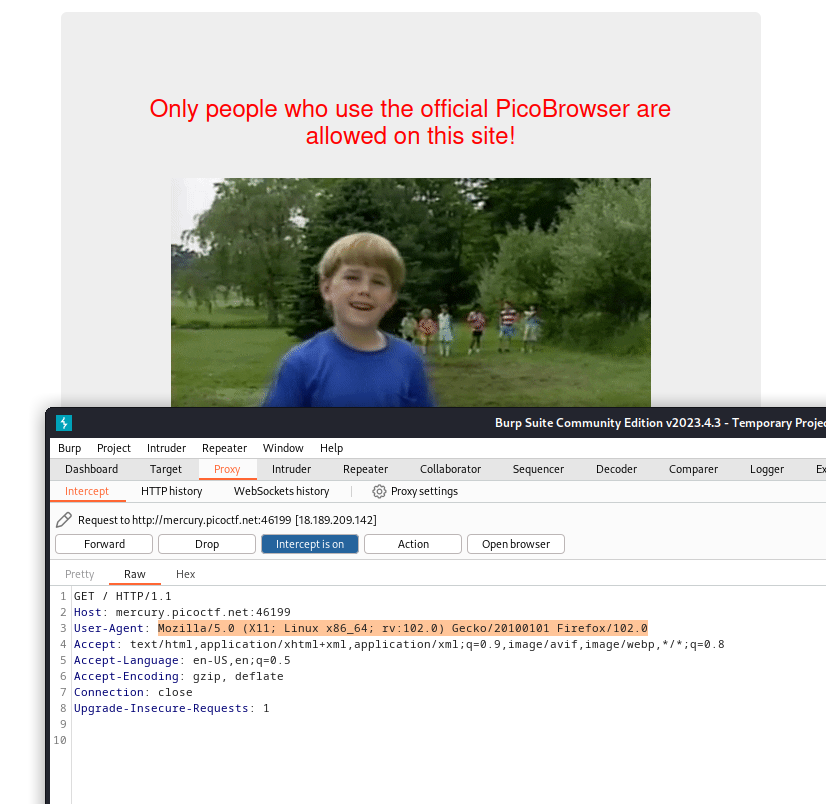

From the hint given I thought I should modify the `User Agent` parameter to tell the website I'm not using Firefox but `PicoBrowser` instead. This is the result :

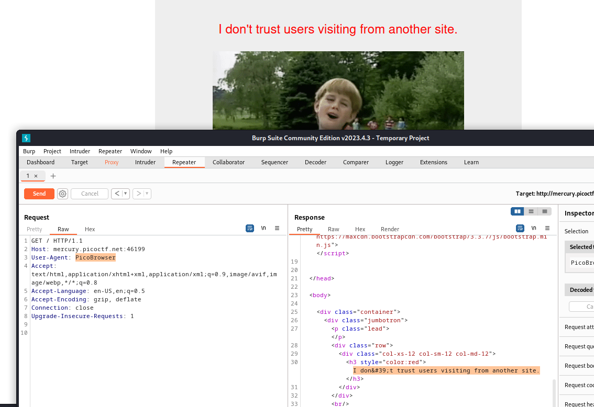

Now it tells us that it doesn't seem like we're using the "right" website. After a lot of research I found out I can use the `Referer` parameter to precisely point at the right website :

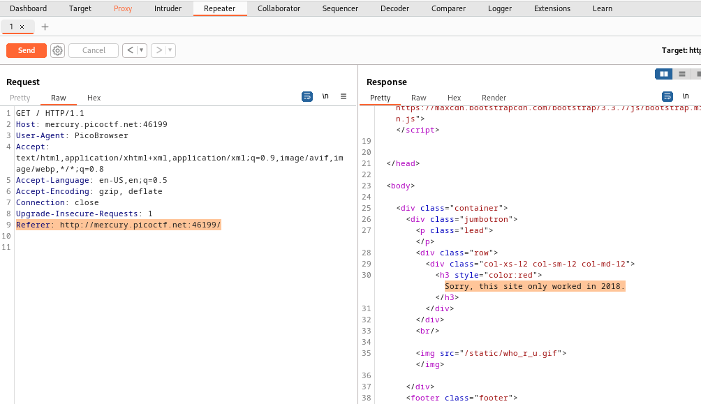

For this goal the `Date` parameter seemed suitable. The following is an example of the parameter structure :

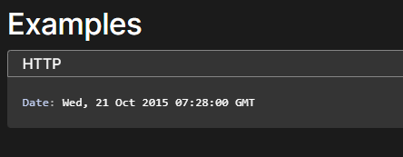

Replacing it with `2018` we have our next hint :

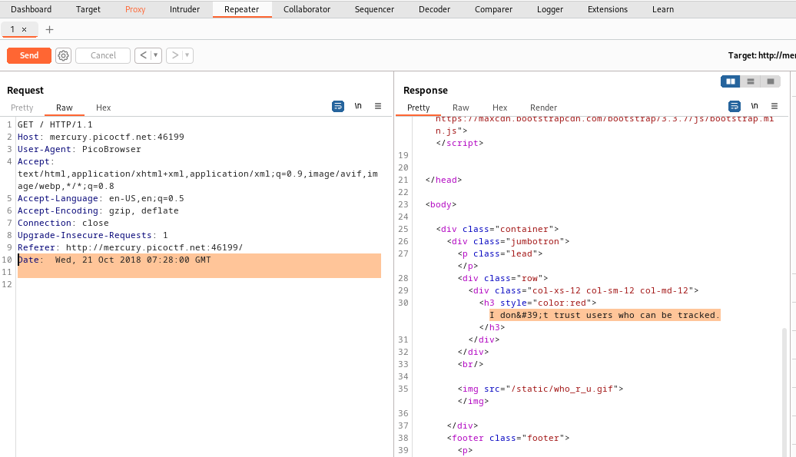

Now we can use the `DNT` (Do Not Track) parameter, this is the structure :

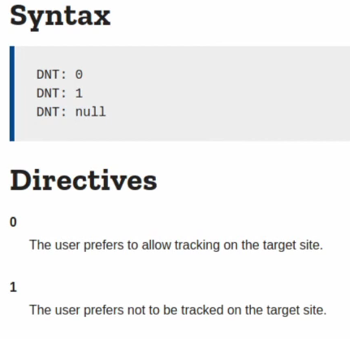

Set the value to `1` and this is the resulting page :

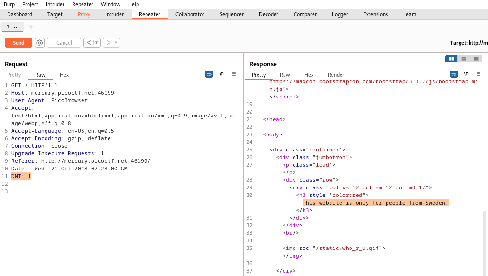

Now we wanna use the `X-Forwarded-For` parameter to forward the request from an IP address we specify. I googled "Swedish ip addresses list", copied one of them and pasted it as the value :

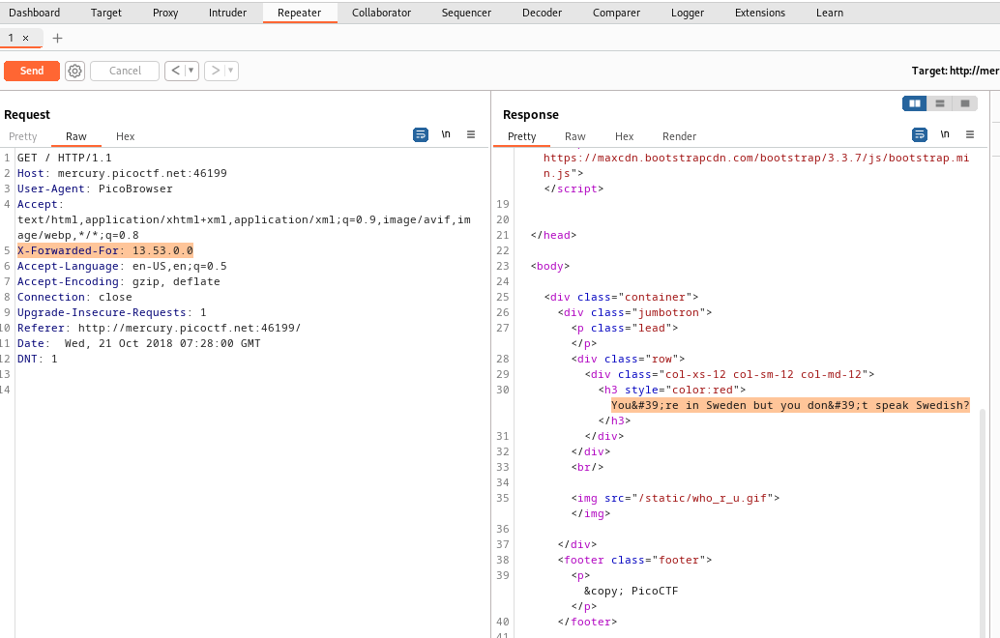

Finally this hint suggests the language used is not accepted. After a lot of research I found that the `Accept-Language` parameter lets us indicate the natural language. This is an example of the structure :

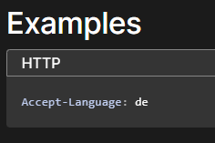

 I found [this list](https://help.sap.com/doc/saphelp_snc700_ehp01/7.0.1/en-US/45/fa0d8983587041e10000000a155369/content.htm?no_cache=true) that helped me find the swedish value for the parameter ( `sv` ) and that's the final step!

 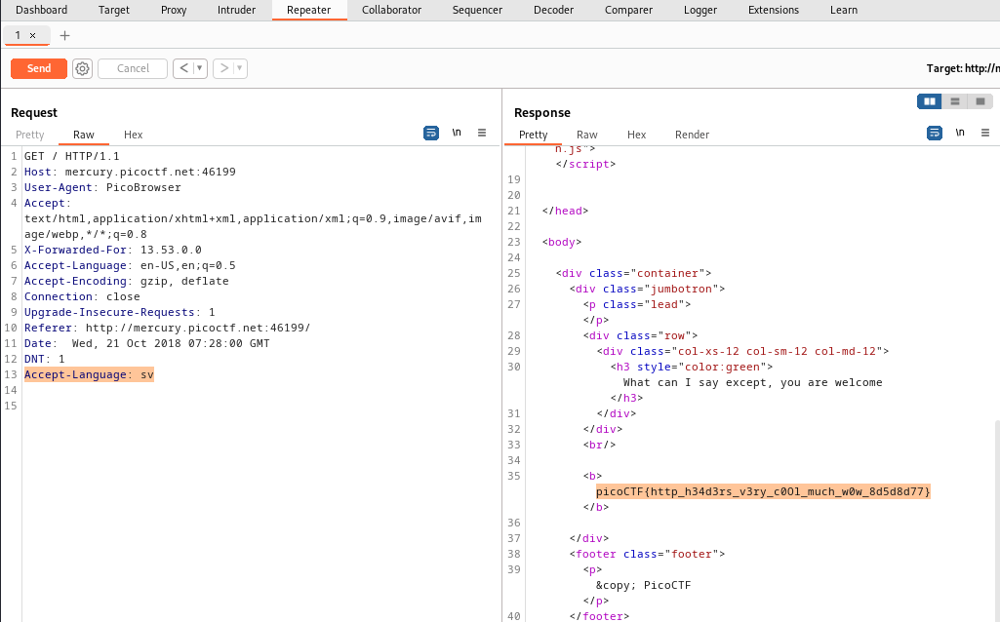

FLAG : `picoCTF{http_h34d3rs_v3ry_c0Ol_much_w0w_8d5d8d77}`