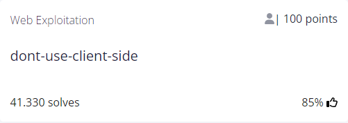

# dont-use-client-side


## Author
ALEX FULTON/DANNY

## Question
> Can you break into this super secure portal? https://jupiter.challenges.picoctf.org/problem/29835/ or http://jupiter.challenges.picoctf.org:29835

## Hint
1. Never trust the client
   
## Solution
The link brings us to the following page :


I tried intercepting the request with Burp while typing a random string in the form but, as the title of the exercise suggests, the website checks the value client side (Burp doesn't intercept anything going out our local host).

So we can find the flag looking at the response when refreshing the page (or glancing at the source code). It is broken in a few pieces :

```html
<script type="text/javascript">
  function verify() {
    checkpass = document.getElementById("pass").value;
    split = 4;
    if (checkpass.substring(0, split) == 'pico') {
      if (checkpass.substring(split*6, split*7) == '723c') {
        if (checkpass.substring(split, split*2) == 'CTF{') {
         if (checkpass.substring(split*4, split*5) == 'ts_p') {
          if (checkpass.substring(split*3, split*4) == 'lien') {
            if (checkpass.substring(split*5, split*6) == 'lz_7') {
              if (checkpass.substring(split*2, split*3) == 'no_c') {
                if (checkpass.substring(split*7, split*8) == 'e}') {
                  alert("Password Verified")
                  }
                }
              }
      
            }
          }
        }
      }
    }
    else {
      alert("Incorrect password");
    }
    
  }
</script>
```
Putting it all together :

`picoCTF{no_clients_plz_7723ce}`
