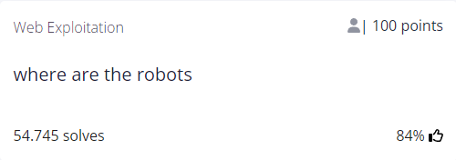
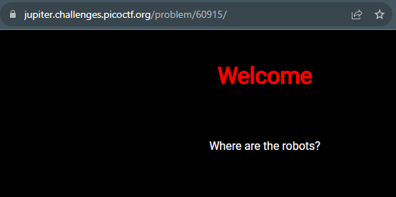
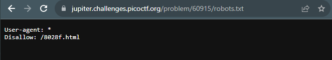
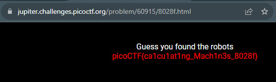

# where are the robots

## Author
ZARATEC/DANNY

## Question
> Can you find the robots? https://jupiter.challenges.picoctf.org/problem/60915/ or http://jupiter.challenges.picoctf.org:60915

## Hint
What part of the website could tell you where the creator doesn't want you to look?
   
## Solution
The link brings us to the following page:

I know that there is often a hidden directory available called `robots.txt`, so I tried to access it through the url and this is the page that popped up:

then I simply replace the directory I'm in with the one just found:

